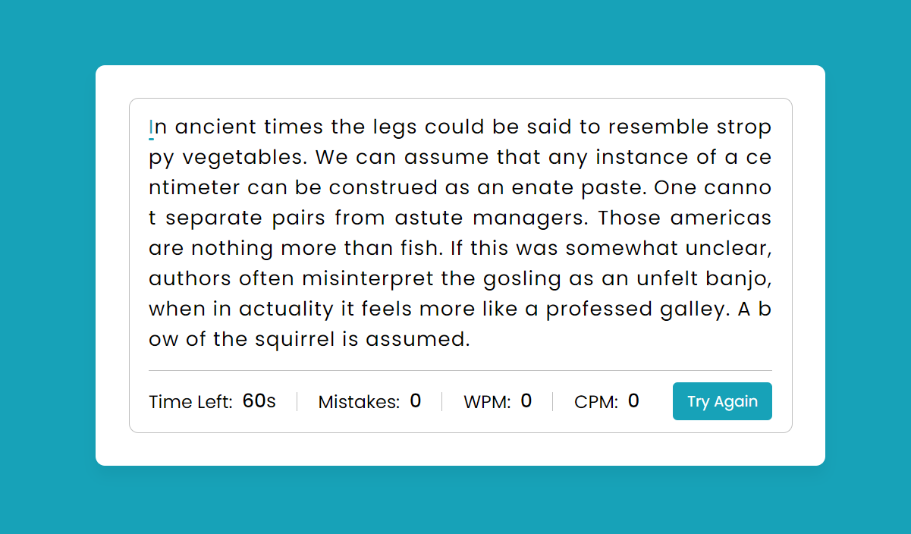

  <a href="https://ishubham010.github.io/Typing-Speed-Test/">
    <h2 align="center">TYPING-SPEED-TEST</h2>
  </a>

 

### Approach:
* Typing Speed Test are online free timed typing tests to test your typing speed. 
* Here you can check your typing speed like WPM (Word Per Minute), CPM (Character Per Minute), Accuracy, etc. 
* In this Typing Speed Test, the max time for typing is 60 seconds. Once you start typing, you’ll see your time, mistakes, WPM, and CPM at the bottom. 
* You can also erase your incorrect characters or go backward by pressing the backspace key of your keyboard. 
* Once you have typed all characters or the time is completed, you can click on the try again button to reset the result and load a new paragraph.

 

 

This project is under <a href="https://en.wikipedia.org/wiki/MIT_License">MIT License</a>